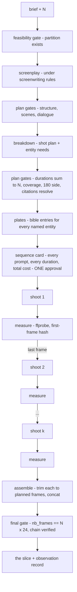
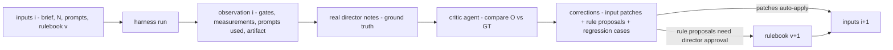

# The Director

An orchestrator agent whose artifact is a **film slice**: a single assembled video of
exactly N seconds, built from takes the existing agents know how to make, under an
explicit cinematic and screenwriting rulebook, inside a learning loop driven by a real
director's notes.

This document is the plan. It is also the contract: what is guaranteed, what is only
measured, and what is honestly a matter of judgment that the loop must learn.

---

## 1 · What can actually be guaranteed

"Guaranteed" means a machine checks it and the run cannot be called done unless the check
passes. Three different strengths exist, and conflating them is how teams end up tricking
their own tests:

| Class | Strength | Mechanism |
|---|---|---|
| **plan** | provable before money is spent | deterministic checks on text and structure: the screenplay, the shot plan, the prompts, the dependency graph |
| **measure** | provable after render | deterministic checks on artifacts: ffprobe, frame hashes, file existence |
| **judgment** | not provable — learnable | the QC loop: real-director notes become new plan/measure gates or regression cases |

**Guarantee A — the artifact is produced.** The production is a finite DAG in which every
node has a deterministic postcondition and a bounded retry budget. Execution is a
topological walk; the run ends in exactly one of two states: *assembled* (every
postcondition holds, machine-checked) or *halted at a named node with the failing
postcondition*. There is no third state and no silent partial success. That is the honest
form of "guaranteed to produce": produced, or a precise refusal — under the stated
assumptions (approved budget, reachable render API).

**Guarantee B — N seconds, within the declared tolerance.** Arithmetic, end to end
(the director chose natural motion ends over frame-exact trimming, so the guarantee is
tolerance-form):

1. *Feasibility gate (plan):* N must admit a partition into k shot durations d₁…d_k with
   each dᵢ within the model slot's window and Σdᵢ = N; k is also the beat count (see
   below). Never 'auto' — an uncontrolled duration makes the total unstatable. An
   infeasible N is refused with the arithmetic shown.
2. *Overshoot gate (measure):* Seedance renders at 24 fps and overshoots the ask
   (measured: a 10s ask yields 241 frames). Each take is probed on decoded frames;
   `measured ≥ planned` and `overshoot ≤ 0.5/k` seconds, or that take re-renders
   (bounded, retryable class) — it never passes short and never eats the whole tolerance.
3. *Final gate (measure):* the assembled slice is probed before publishing:
   `|total − N| ≤ 0.5s`, fps == 24. Blocking.

**Guarantee C — follows the rulebook.** Split by class, never blurred:

- Every **plan-class** rule is guaranteed: violations block before spending.
- Every **measure-class** rule is guaranteed: violations block assembly.
- **Judgment-class** rules are *not guaranteed* — they are the reason the loop exists.
  What IS guaranteed about them: every violation the real director names is recorded
  forever, and the set of plan/measure gates grows monotonically — a named failure either
  becomes a machine gate (and can never silently recur) or a permanent regression case in
  the harness suite. The guaranteed set only ever grows. That is the mathematical claim
  this plan makes about art: not "the wolf will look cornered," but "no mistake survives
  being named twice."

---

## 1a · The input contract and narrative primacy

The UX entry point is anything — "a heist film" is legal. The harness input is the
**Brief**: a hard record (logline, targetSeconds, format, world, cast, locations,
dramatis { protagonist, want, opposition }, optional beats, look, constraints, pinned
rulebook version). The director agent's first job is turning talk into a Brief, asking
for what is missing — never inventing a field.

**Every input dramatizes.** The screenplay node is mandatory: characters worth watching,
a want, an opposition that acts on screen, scenes that turn. Screenwriting plan gates run
and must pass before any cinematic gate is evaluated — the engine stages brief →
screenplay → shotplan and halts at the first failing stage. A slice that is beautiful and
tells nothing is a failed slice.

**Beats and shots are the same number.** Each beat becomes exactly one shot (SCR-005 maps
both directions), so the beat count must be a feasible k for N, and the partition prefers
k = beats. This is checked at the brief (supplied beats), at the screenplay (invented
beats), and again at breakdown.

**Live flow visibility.** The executor's persisted node states are rendered as the
production DAG in the sequence thread — current node with an elapsed clock, done nodes
with their postcondition values, a halted node naming its failing check. The diagram is a
view of the guarantee state, so it can never drift from it, and it survives reload
because the state does.

## 2 · The production DAG



Nodes and postconditions (all machine-checked):

| Node | Postcondition |
|---|---|
| feasibility | ∃ partition d₁…d_k, dᵢ ∈ [3, maxSeconds(slot)], Σ = N |
| screenplay | parses: scenes with sluglines, action, dialogue in the brace grammar |
| breakdown | every shot maps to a scene beat; every named character/location resolves to a bible entry id — no dangling references (graph closure) |
| plates | every referenced entry has a plate (rendered or uploaded) |
| sequence card | approved by a person; manifest lists every verbatim prompt, all refs, all durations, render count |
| shoot i | take exists, `promptUsed == plan.prompt`, measured ≥ dᵢ, first frame of take i matches recorded last frame of take i−1 (perceptual hash ≤ θ) when chained |
| assemble | output exists, `nb_frames == N*24` exactly |

Money: **one card for the whole sequence.** The rule "show everything before spending"
scales up, not down — the card is the full manifest. Per-shot cards would make a 12-shot
slice unmanageable; hiding the manifest would be an escape hatch. Budget: the sequence
declares its render count up front and the executor may not exceed it (retries included —
they draw from a declared retry pool on the same card).

---

## 3 · The rulebook

Rules live on disk, versioned, machine-readable: `rules/cinematic.json` and
`rules/screenwriting.json`. A rule:

```json
{
  "id": "CIN-002",
  "title": "Stay on one side of the line",
  "statement": "A scene declares its line of action; every setup in the scene declares the same side.",
  "class": "plan",
  "appliesTo": "shotplan",
  "blocking": true,
  "provenance": { "origin": "seed" },
  "status": "active"
}
```

- `class` decides enforcement: `plan` and `measure` rules have a check implementation and
  block; `judgment` rules are prompt doctrine + critic criteria only.
- `provenance` is the learning trail: `seed` rules ship with the harness; learned rules
  carry the iteration and note that created them.
- The rulebook rides into the screenplay/breakdown prompts the way skills ride into
  compose — verbatim, and unbound means refused: a Director run with no rulebook does not
  fall back to taste.

Seed rules ship in this plan's first phase (see the two JSON files). Judgment-class seeds
include the things everyone knows and no machine can check: a scene turns on a value
change; coverage earns its close-ups; cut on action, not after it.

---

## 4 · The QC / learning loop

Append-only, and the critic can touch inputs — never gates.



**Observation** (`iteration` record, stored per sequence, append-only): every gate result,
every measurement, every prompt as sent, seeds, timings, artifact refs. A failed gate is
recorded permanently — a later success is a new iteration, never an edit of the old one.

**Ground truth**: the real director's notes on the artifact — free text, optional
timecode, optional rule reference, severity. Entered in the sequence thread.

**Critic**: an agent (registry module like every other, with its own ≥5-case suite) whose
only outputs are: (a) input patches for the next iteration — prompt edits, duration
rebalances, plate swaps; (b) rule proposals — "this note is checkable; here is the rule
and its class"; (c) regression cases. The critic **cannot** modify a check, a threshold, a
gate, or a past record. Rule proposals that add gates activate only on director approval —
gates are law, and law changes are signed.

**Anti-gaming invariants** (enforced in code, tested):
- Gates read artifacts, never intentions: duration from ffprobe, not the request;
  continuity from frame hashes, not from "chaining was enabled".
- Iteration records are append-only; no API exists to mutate one.
- The critic's tool row contains no gate-editing tool — the row IS its authority.
- A gate, once learned from a note, cannot be deactivated except by the director, and the
  deactivation is itself a recorded note.
- The harness's own test suite gains every learned regression; the agent-test rule
  (≥5 inputs per agent) applies to the director and the critic like everyone else.

---

## 5 · What gets built, in order

Each phase lands with its tests green and ends somewhere you can stand.

| Phase | Ships | Exit test |
|---|---|---|
| **D1 · Rulebook + gate engine** | rules/*.json, loader, classes enforced, feasibility partition, gate runner as pure functions | unit suite: partition math, rule loading, class blocking; no network |
| **D2 · Screenplay + breakdown** | `screenplay` and `breakdown` tools under the rulebook; shot-plan graph with entity closure | director agent routes and plans 5+ briefs; all plan gates green; dangling refs refused |
| **D3 · Executor + assembler** | sequence card (full manifest, one approval), chained shoots, per-take measurement, ffmpeg trim/concat (`ffmpeg-static` installed — the deferral ends here) | a real slice: ffprobe shows exactly N×24 frames; chain hashes pass |
| **D4 · Observation store** | append-only iteration records in the sequence; surfaced in the thread | record contains every gate result and prompt; mutation API does not exist |
| **D5 · Critic + notes** | GT note entry in the sequence thread; critic agent + suite; corrections apply to inputs; proposals await approval | a seeded note produces a patch that changes iteration i+1's inputs; the failure is stored; a proposal becomes a gate only after approval |
| **D6 · The live loop** | you direct, it learns | a note you write about a real slice cannot recur unfixed past one iteration |

D1–D2 spend nothing. D3 is the first real money (one approved sequence).

---

## 6 · Decisions needed before D1

1. **Frame standard**: exact N at 24 fps via deterministic trim (recommended, provable).
   Alternative — honor 'auto' durations and accept ±: weaker, not recommended.
2. **Audio in v1**: chaining + trim work with audio, but trimmed audio cuts hard. Proposal:
   v1 renders silent, audio is a later phase. Say if audio must be in from the start.
3. **One approval card per sequence** (whole manifest, declared retry pool) — confirm.
4. **Slice size for the loop's first runs**: propose N ∈ [10, 30], 2–4 shots, so an
   iteration costs minutes, not an afternoon.

## Grounded in precedent

The director does not invent film craft from a blank page. Every decision — beat shape at N seconds, setup selection, prompt phrasing, thresholds — retrieves precedent from the reference corpus: annotated shots and cuts from real films, beat sheets with timings, calibration statistics measured on real footage, and the house library of every take this studio has rendered and judged. What the corpus is, where its data verifiably lives, and the laws that keep retrieval advisory rather than an escape hatch are defined in [CORPUS.md](CORPUS.md). The short version: gates remain the only law; precedent shapes plans and is cited in the iteration record, so bad evidence is as findable as bad rules.

